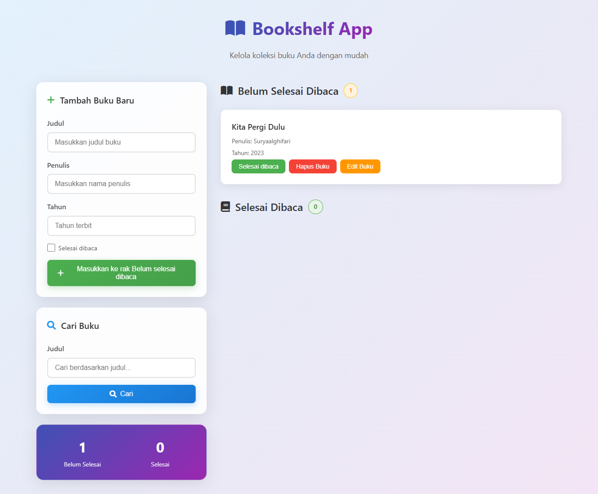

# 📚 Bookshelf App

Bookshelf App adalah aplikasi manajemen koleksi buku berbasis web yang membantu Anda melacak buku yang sedang atau sudah Anda baca. Aplikasi ini dibangun dengan HTML, CSS, dan JavaScript, serta menyimpan data secara lokal menggunakan `localStorage`, sehingga tidak memerlukan backend/server.



---

## ✨ Fitur Utama

- 📖 **Tambah Buku Baru** ke dalam rak "Belum Selesai Dibaca" atau "Selesai Dibaca"
- 🔍 **Cari Buku** berdasarkan judul dengan form pencarian
- 🔄 **Tandai Buku** sebagai selesai atau belum selesai
- 📝 **Edit dan Hapus Buku**
- 📊 **Statistik Buku** yang diperbarui secara otomatis
- 💾 **Penyimpanan Data Lokal** menggunakan `localStorage`

---

## 🧠 Teknologi & Konsep yang Dipelajari

Proyek ini mencerminkan pemahaman terhadap:

- ✅ **HTML5** dan struktur DOM
- ✅ **CSS3** untuk styling (termasuk layout responsive dan Flex/Grid)
- ✅ **Font Awesome** untuk ikon visual
- ✅ **JavaScript Vanilla** (tanpa library) untuk manipulasi DOM dan logika aplikasi
- ✅ **Form handling**, validasi input, dan event listener
- ✅ **Penyimpanan lokal** menggunakan `localStorage`
- ✅ **Penggunaan atribut `data-testid`** untuk keperluan pengujian otomatis

---

## 📂 Struktur Proyek

bookshelf-app/
├── assets/
│ └── book-shelf.png
├── index.html
├── style.css
└── main.js

---

## 🖼️ Tampilan Antarmuka

Berikut ini tampilan utama dari aplikasi:

### 📋 Form Tambah Buku

Form interaktif yang memudahkan pengguna memasukkan judul, penulis, dan tahun terbit buku.

### 📚 Daftar Buku

Daftar buku dikelompokkan berdasarkan status "Belum Selesai Dibaca" dan "Selesai Dibaca", dilengkapi tombol tindakan:

- ✅ Selesai dibaca
- 🗑️ Hapus buku
- ✏️ Edit buku

### 📊 Statistik

Menampilkan jumlah buku berdasarkan status baca.

---

## 🚀 Cara Menjalankan

1. Clone repositori ini:
   ```bash
   git clone https://github.com/username/bookshelf-app.git
   cd bookshelf-app
   Buka file index.html menggunakan browser:
   ```
